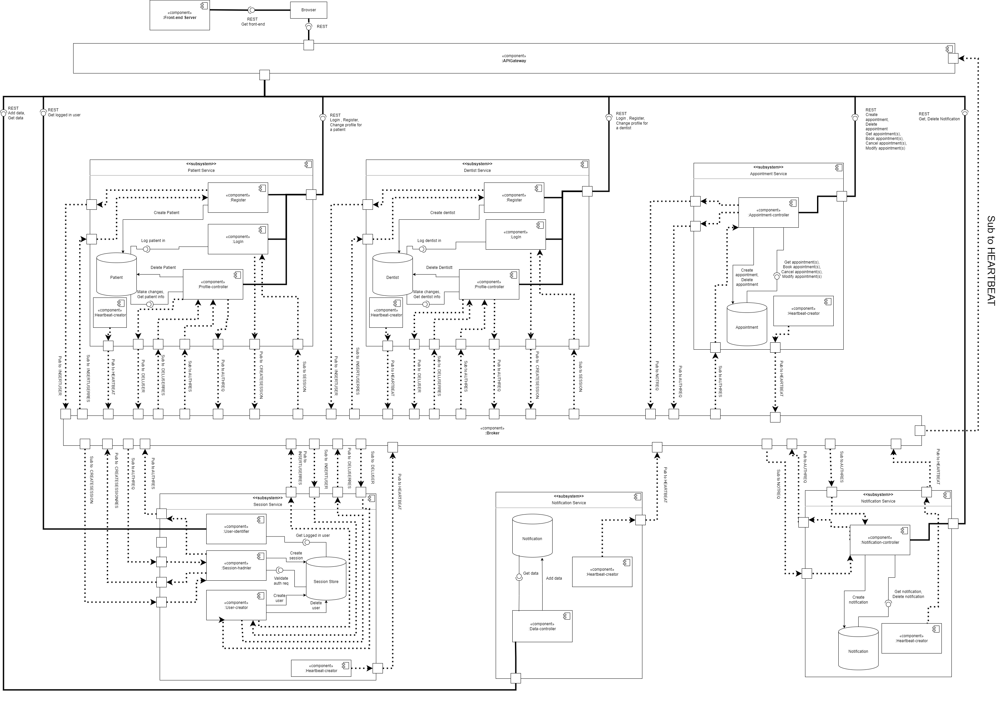
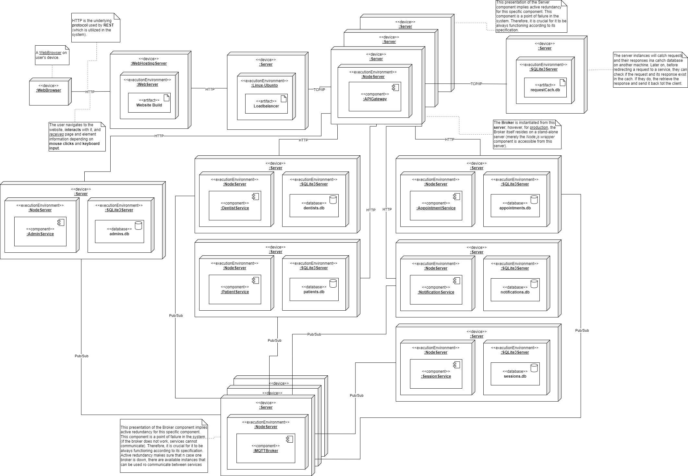

<h2 align="center">AppointDent</h2>

&#129463;&#129701; **AppointDent** is a **full-stack web application** that allows residents of Sweden
manage their dentist appointments, as well as a tool for dentists to organize
their work. The system, internally, relies on a **distributed system** infrastructure that combines various architectural styles, namely **microservices**, **publish-subscribe** and **client-server**.

 

**Table of Contents**

- [Introduction](#introduction)
- [Tech-stack](#tech-stack)
- [Pre-Requirements](#pre-requirements)
  - [Installation, Setup, and Running](#installation-setup-and-running)
  - [API](#api)
- [System's Overview](#systems-overview)
- [Continuos Integration](#continuos-integration)
- [Development team](#development-team)

<!-- table of contents subject to be updated -->

## Introduction

**AppointDent** is a system that allows residents of **Sweden** to book dentist
appointments. A user can find available times and see the dentist on an
integrated map.

AppointDent allows users to book appointments, cancel them, as well as receive
notifications about their bookings. The dentists in our system make use of a
calendar to navigate their appointments and manage their availability.

The solution is based on a **distributed system** infrastructure that combines
various architectural styles, namely **microservices**, **publish-subscribe**
and **client-server**.

## Tech-stack

- [TypeScript](https://github.com/microsoft/TypeScript) (client, server, services)
- [Node.js](https://nodejs.org/en/) (client, server, services)
- [Vite.js](https://vitejs.dev/) (client)
- [Express.js](https://expressjs.com/) (server, services)
- [Solid.js](https://www.solidjs.com/) (client)
- [Sqlite3](https://www.sqlite.org/index.html) (`node` wrapper: [better-sqlite3](https://github.com/WiseLibs/better-sqlite3)) \[services\]
- [Tailwind CSS](https://tailwindcss.com/) (client)

## Pre-Requirements

The only technology that is utilized in building and running **all services**, **APIGateway (server)**, the **client**, and **stress-testing** is [Node.js](https://nodejs.org/en/). Our project makes use of version `18.x.x`. So make sure that you have one of the version `18` variations installed on your machine. For those that do not know what **Node.js** is, **Node.js** is a cross-platform **JavaScript runtime environment**. It allows developers to run JavaScript outside of the browser. This allows Javascript to be used as a backend development programming language.

### Installation, Setup, and Running

This repository utilizes a **monorepo** structure, where the individual sub-folders represent a particular component of the system, wherein each component has its own `README.md` file.

The file contains the instructions on how to install all dependencies, it explains the structure of the directory, and it lists all the available scripts (with possible clarifications).

The following is a list of the available sub-folders:

- [**client**](./client/README.md): the client-side application.
- [**server**](./server/README.md): the server-side application (informally, the `APIGateway/Proxy`).
- [**services/admin-service**](./services/admin-service/README.md): the additional service that adds an abstraction of an admin to observe the system's state and trends.
- [**services/appointment-service**](./services/appointment-service/README.md): the service that handles all the appointment-related operations.
- [**services/dentist-service**](./services/dentist-service/README.md): the service that handles all the dentist-related operations.
- [**services/notification-service**](./services/notification-service/README.md): the service that enables the system to send notifications to the users upon certain events.
- [**services/patient-service**](./services/patient-service/README.md): the service that handles all the patient-related operations.
- [**services/session-service**](./services/session-service/README.md): a central service that handles all sessions of the users to enforce authentication and authorization.
- [**stress-testing**](./stress-testing/README.md): a folder that contains the scripts that are used to stress-test the system at a high load.

*Note*: the `services` are not meant to be run individually, but rather as a part of the `server` application. They can be run individually for testing purposes or for the ease of development.

### API

To support further development of the system, we aim to maintain a comprehensive
`API` documentation on how to work with the system. The
documentation is available on the project's [`wiki`](https://git.chalmers.se/courses/dit355/2023/student-teams/dit356-2023-02/group-02/-/wikis/Api).

## System's Overview

The following section aims to provide an overview of the **system's architecture**, as well as the **deployment strategy**. The individual diagrams can observed when clicking on the dropdowns.

  
1. Entity Relationship (ER) Diagram

  

  
2. Component Diagram

  

  
3. Deployment Diagram

  

## Continuos Integration

The development team made use of the **continuos integration (CI)** testing
practice to improve the development process model (which was **Scrum**) tha was
used in the development of the system. This allowed the team to continuously
build and test the code in order to prevent pushing defected code into the
**main** branch.
The team made use of **Postman** as means of integration testing of the backend
and the database of the system. Moreover, the team made use of static analysis
(**ESLint**) to make sure good quality and readable code with no syntax bug is
pushed into the **main** branch. 
In order to make use of CI, the team made use of **GitLab's CI/CD** feature. The
[`gitlab-ci.yml`](https://git.chalmers.se/courses/dit355/2023/student-teams/dit356-2023-02/group-02/-/blob/main/.gitlab-ci.yml?ref_type=heads)
file contains the instructions that are used by GitLab to run
**Postman** tests, statically analyze code, and build the system.

## Development team

The project has been developed over the course of **10 weeks** by the following:

| Name               | username (Chalmers GitLab) |
|--------------------|----------------------------|
| Agrima Singh       | @agrima                    |
| Mariia Zabolotnia  | @mariiaz                   |
| Alexander Säfström | @alesaf                    |
| Michal Spano       | @spano                     |
| Kaisa Arumeel      | @arumeel                   |
| Omid Khodaparast   | @omidk                     |